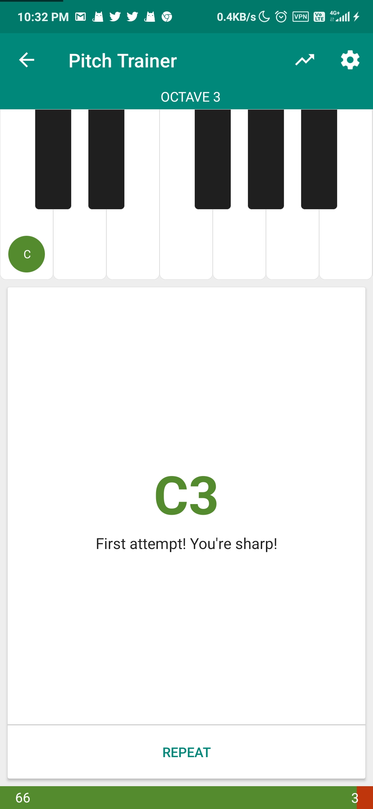
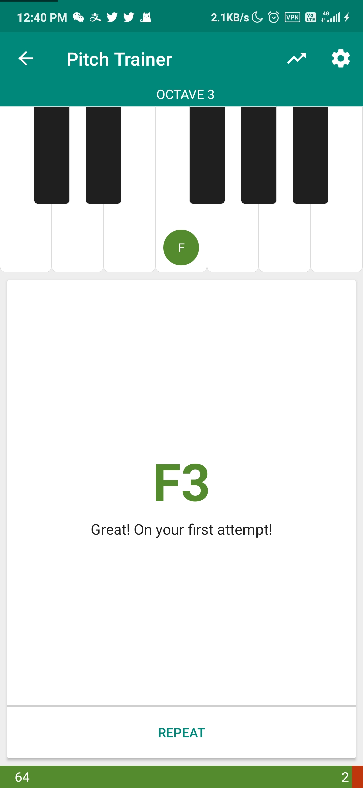

# Things todo Today

[date]

## TODO List

__Practice bAss for your band!!__

- [x] Basic scale
- [x] Groove is important
- [x] Controling and Endurance
- [x] Why not play a song  

__Practice Keyboard to maintain your finger skill.__

- [ ] Hanon - Virtuoso Pianist in 60 Exercises
- [ ] Play something for fun!!  

__Maintain your hearing, don't be DEAF!!__

- [x] Interval
- [x] Chord
- [x] Rhythm
- [x] Sight reading
- [x] Absolute pitch
- [x] Note singing  

__Just listen to some music you like.__

- [x] Have fun  

## What did you do, Any midi or recording
Practiced:
  
NoPartyForCaoDong - __情歌__ full song
Greenday - __Holiday/BoulevardOfBrokenDreams__ full song
PinkFloyd - __ComfortablyNumb__ full song
  
Part of the ear trainning this week
  

  

  

  

